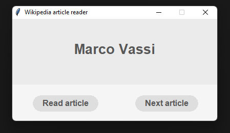

<div align="center">
    
    <h2>Wikipedia's article wrapper</h2>
</div>

So since I was really bored and had free time I decided to make a simple web scrapper being made in `Python`, I know I have been playing a lot recently with this language. Anyway, this was an interesting project I saw in an article [here](https://www.upgrad.com/blog/python-projects-ideas-topics-beginners/#21_Random_Wikipedia_Article) and I decided to give it a go because why not, right? 

Anyway, this was kinda challenging (talking about the GUI as finding how to make round buttons without images was hard) and I think it ended up being amazing!

Simple look to it...



Pretty cool right? Anyway, I would have opted for a dark theme, but I'm not gonna lie, I like how it looks right now.

### Installation

Well the installation it's pretty simple, if you want to build the code at your own then it will be a little harder as you need to install various dependencies!

If not, go the release page and download the `.exe` file! Either way, you're welcomed to download the source code or just run this command in your terminal:
````
git clone https://github.com/siriuslatte/calc-py.git
````

From there you need these:
````
pip3 install customtkinter
pip3 install requests
pip3 install beautifulsoup4
````

And you're ready to go, happy coding!

###### *Thank you for being interested!*